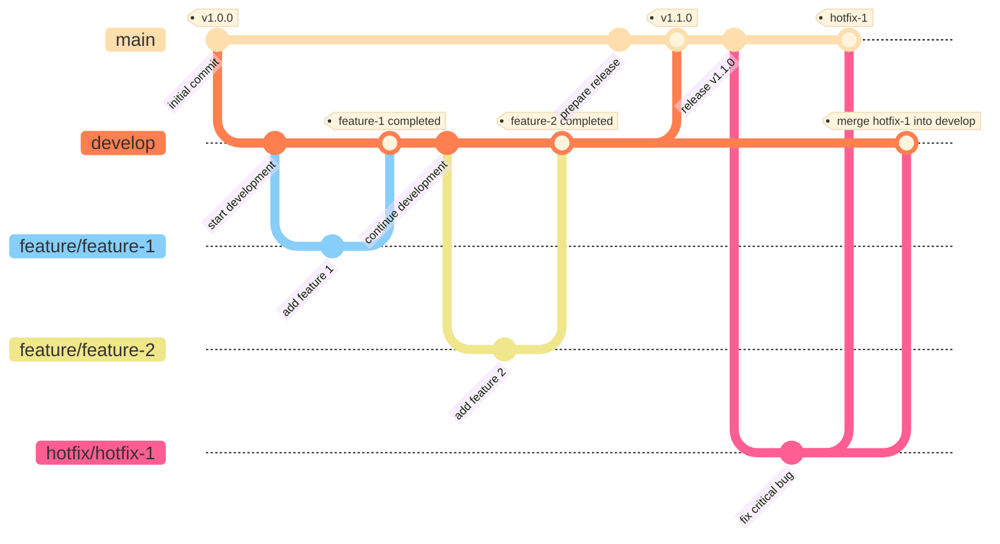

# Developing ramen-api

## Development Workflow

1. Create an issue
2. Implement
3. Pull request
4. Review and revise
5. Merge

## Git branching strategy

## Type

- **main**:
  - Contains stable, released code.
  - Only includes code that is deployed to the production environment.
- **develop**:
  - Contains development code for the next release.
  - All new features and fixes are integrated here.
- **feature**:
  - Used for developing individual new features or improvements.
  - Branches off from the develop branch and merges back into the develop branch after development is complete.
  - Naming convention: **feature/ISSUE_NUMBER**
- **hotfix**:
  - Used for urgent fixes to the main branch.
  - Branches off from the main branch and merges back into both the main and develop branches after the fix is complete.
  - Naming convention: **hotfix/ISSUE_NUMBER**

## Git Commit Guidelines

### Type

Must be one of the following:

- **feat**: A new feature
- **fix**: A bug fix
- **docs**: Documentation only changes
- **style**: Changes that do not affect the meaning of the code (white-space, formatting, missing semi-colons, etc)
- **refactor**: A code change that neither fixes a bug nor adds a feature
- **test**: Adding missing or correcting existing tests
- **chore**: Changes to the build process or auxiliary tools and libraries such as documentation generation
